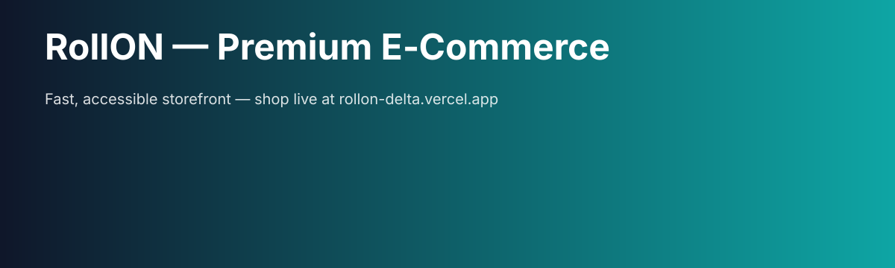

# RollON — Premium Smoking Accessories Storefront

<div align="center">



**A modern, configuration-driven e-commerce template built with React 19, TypeScript, and Tailwind CSS.**

[](https://rollon-delta.vercel.app)
[](LICENSE)
[](https://www.typescriptlang.org)
[](https://react.dev)
[](https://tailwindcss.com)
[](https://github.com/FahadIbrahim93/RollON-MVP-Final-V1/actions)
[](https://github.com/FahadIbrahim93/RollON-MVP-Final-V1/actions)
[](https://github.com/FahadIbrahim93/RollON-MVP-Final-V1/actions)

</div>

## 🎯 Overview

RollON is a production-ready e-commerce storefront for premium smoking accessories. It features a sleek dark theme, responsive design, and a configuration-driven architecture that makes it easy to customize for any business.

**Live Demo:** [rollon-delta.vercel.app](https://rollon-delta.vercel.app)

## ✨ Features

- 🛍️ **Complete Storefront** — Product catalog, cart, checkout, and order confirmation
- 🎨 **Config-Driven Branding** — Customize business identity, colors, and content via a single config file
- 📱 **Fully Responsive** — Mobile-first design that works on all devices
- ⚡ **Blazing Fast** — Vite 7 build, code splitting, lazy loading
- 🌙 **Dark Theme** — Modern dark UI with Tailwind CSS v4
- 🔍 **SEO Optimized** — Meta tags, Open Graph, structured data, semantic HTML
- ♿ **Accessible** — WCAG 2.1 AA compliant, keyboard navigation, ARIA labels
- 📦 **Type-Safe** — Full TypeScript coverage with strict mode
- 🧩 **Modular Architecture** — Reusable components, Zustand state management
- 🛡️ **Secure** — CSP headers, env validation, no hardcoded secrets

## 🚀 Quick Start

### Prerequisites

- [Node.js](https://nodejs.org/) 20+ 
- [npm](https://www.npmjs.com/) or [pnpm](https://pnpm.io/)

### Installation

```bash
# Clone the repository
git clone https://github.com/FahadIbrahim93/RollON-MVP-Final-V1.git
cd RollON-MVP-Final-V1

# Install dependencies
cd rollon-app
npm install

# Start development server
npm run dev
```

Visit [http://localhost:5173](http://localhost:5173) to see the app.

## 🎨 Customization

RollON is designed to be easily customized. Here's how:

### 1. Update Site Configuration

Edit `rollon-app/src/lib/config.ts`:

```typescript
export const siteConfig: SiteConfig = {
  name: 'Your Business Name',
  tagline: 'Your tagline here',
  description: 'Your business description',
  email: 'your@email.com',
  phone: '+1234567890',
  // ...
};
```

### 2. Update Branding

```typescript
export const brandConfig: BrandConfig = {
  primary: '#your-primary-color',
  secondary: '#your-secondary-color',
  logo: '/assets/your-logo.svg',
  heroTitle: 'Your hero title',
  // ...
};
```

### 3. Update Products

Replace the product data in `rollon-app/src/data/products.ts` with your own products.

### 4. Update Images

Replace images in `rollon-app/public/images/` with your brand assets.

### 5. Customize Theme

Edit `rollon-app/index.css` to change the color scheme and design tokens.

See [docs/TEMPLATE_GUIDE.md](docs/TEMPLATE_GUIDE.md) for a complete customization guide.

## 📁 Project Structure

```
RollON-MVP-Final-V1/
├── rollon-app/                 # Main application
│   ├── src/
│   │   ├── components/         # Reusable UI components
│   │   │   ├── layout/         # Navbar, Footer, ErrorBoundary
│   │   │   ├── sections/       # Hero, Features, Testimonials
│   │   │   ├── shop/           # ProductCard, ProductGrid
│   │   │   └── ui/             # Base UI primitives (shadcn/ui)
│   │   ├── data/               # Product catalog, categories
│   │   ├── hooks/              # Custom React hooks
│   │   ├── lib/                # Config, utilities, API, SEO
│   │   ├── pages/              # Route components
│   │   ├── store/              # Zustand state stores
│   │   └── types/              # TypeScript type definitions
│   ├── public/                 # Static assets
│   ├── e2e/                    # Playwright E2E tests
│   ├── index.html              # HTML entry point
│   ├── package.json            # Dependencies and scripts
│   ├── vite.config.ts          # Vite configuration
│   ├── tsconfig.json           # TypeScript configuration
│   └── eslint.config.js        # ESLint configuration
├── server/                    # Reference API server (zero-dependency Node)
│   ├── index.js               # Implements the docs/API.md contract
│   ├── seed.json              # Catalog snapshot (generated from app data)
│   └── test/                  # 23 integration tests (node:test)
├── docs/                       # Documentation
│   ├── ARCHITECTURE.md         # System architecture
│   ├── TEMPLATE_GUIDE.md       # Customization guide
│   └── API.md                  # Backend API contract
├── .github/                    # GitHub configuration
│   ├── workflows/              # CI/CD pipelines
│   ├── ISSUE_TEMPLATE/         # Bug, feature, question templates
│   └── PULL_REQUEST_TEMPLATE.md
├── vercel.json                 # Vercel deployment config
├── LICENSE                     # MIT License
├── README.md                   # This file
└── CONTRIBUTING.md             # Contribution guidelines
```

## 🛠️ Tech Stack

| Category | Technology | Purpose |
| :--- | :--- | :--- |
| **Framework** | React 19 | Component UI library |
| **Language** | TypeScript ~5.9 | Type safety |
| **Build Tool** | Vite 7 | Fast HMR and builds |
| **Styling** | Tailwind CSS 4 | Utility-first CSS |
| **Routing** | React Router 7 | Client-side navigation |
| **State** | Zustand 5 | Global state management |
| **Data Fetching** | React Query 5 | Server state and caching |
| **Forms** | React Hook Form + Zod | Form handling and validation |
| **Animations** | Framer Motion 12 | Animations and transitions |
| **UI Primitives** | Radix UI | Accessible unstyled components |
| **Testing** | Vitest 4 + Playwright | Unit and E2E testing |
| **Deployment** | Vercel | Static hosting |

## 🧪 Development

```bash
# Start development server
npm run dev

# Run linter
npm run lint

# Run unit tests
npm test -- --run

# Run tests with coverage
npm run test:coverage

# Run E2E tests
npx playwright test

# Build for production
npm run build

# Preview production build
npm run preview
```

## 🚢 Deployment

### Vercel (Recommended)

1. Push your code to GitHub
2. Connect your repository to [Vercel](https://vercel.com)
3. Vercel auto-detects the Vite configuration
4. Deploy!

The `vercel.json` includes SPA rewrites and security headers.

### Other Platforms

The app builds to a static `dist/` folder:

```bash
cd rollon-app
npm run build
```

Serve the `dist/` folder with any static file server (Nginx, Apache, Cloudflare Pages, etc.).

## 📄 Documentation

- [Architecture Overview](docs/ARCHITECTURE.md)
- [Template Customization Guide](docs/TEMPLATE_GUIDE.md)
- [Backend API Contract](docs/API.md)
- [Contributing Guidelines](CONTRIBUTING.md)
- [Security Policy](SECURITY.md)
- [Changelog](CHANGELOG.md)

## 🤝 Contributing

Contributions are welcome! Please read our [Contributing Guide](CONTRIBUTING.md) before submitting a pull request.

## 📄 License

This project is licensed under the [MIT License](LICENSE).

## 📞 Support

- **Email**: FahadIbrahim93@gmail.com
- **GitHub Issues**: [Open an issue](https://github.com/FahadIbrahim93/RollON-MVP-Final-V1/issues)
- **Live Demo**: [rollon-delta.vercel.app](https://rollon-delta.vercel.app)

---

<div align="center">

**Built with ❤️ by [Fahad Ibrahim](https://github.com/FahadIbrahim93)**

</div>